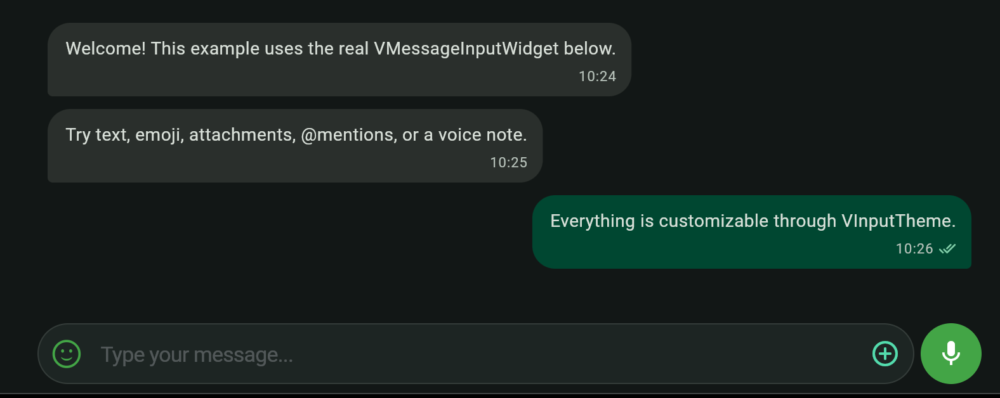
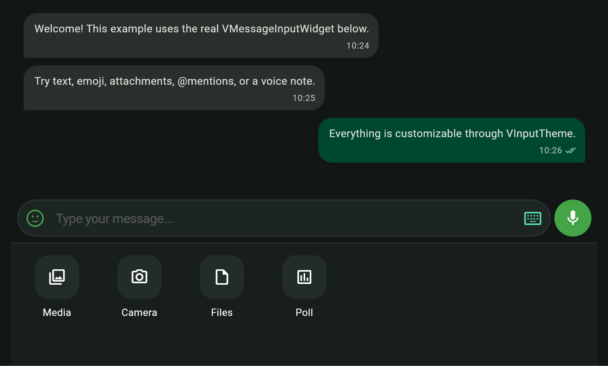
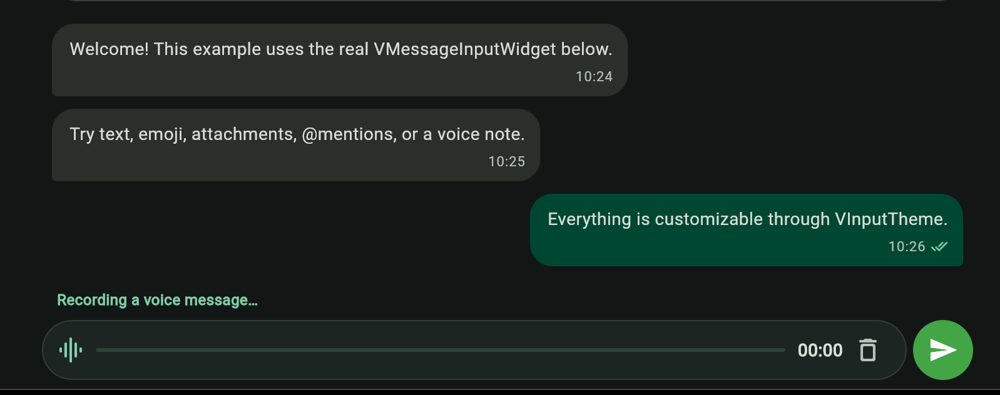
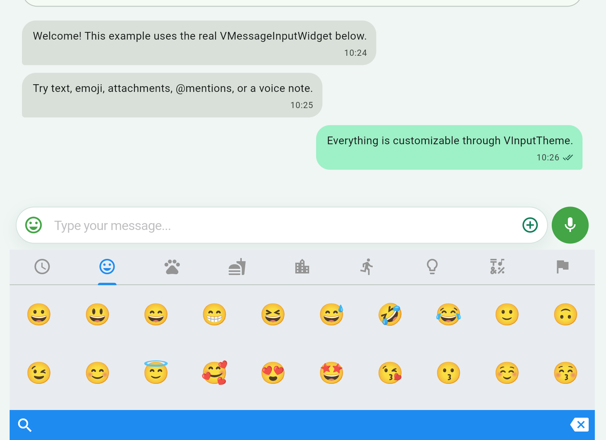

# V Chat Input UI

[](https://pub.dev/packages/v_chat_input_ui)
[](https://pub.dev/packages/v_chat_input_ui/score)
[](LICENSE)

A production-ready Flutter chat composer for text, emoji, mentions, media, files, locations, typing state, and voice messages. It is part of the V Chat SDK ecosystem, but works as a standalone package with any messaging backend.

## Preview

| Chat composer | Inline attachment tray |
| --- | --- |
|  |  |
| Custom recording UI | Emoji picker and light theme |
|  |  |

## Features

- Text input with automatic RTL/LTR direction and multiline support
- Emoji picker and asynchronous `@mention` suggestions
- Media, document, camera, and optional Google Maps location actions
- Adaptive action-sheet, modal bottom-sheet, and animated inline attachment presentations
- Typed built-in and consumer-defined attachment actions with grid, horizontal, and wrap layouts
- Voice recording with a configurable maximum duration
- Typed callbacks for every submitted payload and typing-state transition
- Light/dark theming through `VInputTheme`
- Custom labels, tooltips, attachment flow, reply UI, and closed-chat UI
- Independently configurable emoji, attachment, camera, and recorder actions

## Installation

```sh
flutter pub add v_chat_input_ui
```

The package currently requires Flutter 3.44 or newer and Dart 3.12 or newer.

## Quick start

```dart
import 'package:flutter/foundation.dart';
import 'package:v_chat_input_ui/v_chat_input_ui.dart';

VMessageInputWidget(
  onSubmitText: (message) => debugPrint('Text: $message'),
  onSubmitMedia: (files) => debugPrint('Media: ${files.length}'),
  onSubmitFiles: (files) => debugPrint('Files: ${files.length}'),
  onSubmitLocation: (_) => debugPrint('Location selected'),
  onSubmitVoice: (voice) =>
      debugPrint('Voice duration: ${voice.durationObj}'),
  onTypingChange: (state) => debugPrint('Composer state: $state'),
);
```

All callbacks are local; this package does not upload files or send network requests on your behalf.

## Customize the composer

Register `VInputTheme` as a Flutter theme extension:

```dart
MaterialApp(
  theme: ThemeData(
    extensions: [
      VInputTheme.light(
        composerActionExtent: 52,
        containerDecoration: BoxDecoration(
          color: Colors.white,
          borderRadius: BorderRadius.circular(24),
        ),
        sendBtn: const CircleAvatar(
          backgroundColor: Colors.teal,
          child: Icon(Icons.send, color: Colors.white),
        ),
        attachmentTheme: VAttachmentThemeData.light(
          panelDecoration: BoxDecoration(color: Color(0xFFF7FAF9)),
          actionExtent: 88,
          spacing: 12,
        ),
      ),
    ],
  ),
);
```

`composerActionExtent` keeps the Send and Record controls square and applies
the same minimum height to the one-line input container. The default is 48.

Disable actions that your product does not need:

```dart
VMessageInputWidget(
  enableEmojiPicker: true,
  enableAttachments: true,
  enableCamera: false,
  enableVoiceRecording: false,
  // Required submission callbacks...
);
```

Localize visible text and accessibility labels with `VInputLanguage`:

```dart
const VInputLanguage(
  textFieldHint: 'Write a message',
  media: 'Photos and videos',
  files: 'Documents',
  camera: 'Camera',
  attachmentPanelLabel: 'Choose an attachment',
  openAttachmentsButtonLabel: 'Open attachments',
  returnToKeyboardButtonLabel: 'Return to keyboard',
  sendButtonLabel: 'Send message',
  recordButtonLabel: 'Record voice message',
);
```

## Attachment presentations

`adaptiveActionSheet` remains the backward-compatible default. Choose a modal panel or a tray mounted directly beneath the composer when your product needs a richer action menu:

```dart
final composerController = VMessageInputController();

VMessageInputWidget(
  controller: composerController,
  attachmentPresentation: VAttachmentPresentation.inlineTray,
  attachmentLauncherPlacement:
      VAttachmentLauncherPlacement.leadingOutside,
  attachmentPanelLayout: VAttachmentPanelLayout.grid,
  attachmentActions: [
    const VAttachmentAction.media(label: 'Photos'),
    const VAttachmentAction.camera(),
    const VAttachmentAction.files(label: 'Document'),
    VAttachmentAction.custom(
      id: 'poll',
      label: 'Poll',
      icon: const Icon(Icons.poll_outlined),
      onPressed: (context) async {
        await openPollComposer(context);
      },
    ),
  ],
  // Required submission callbacks...
);
```

The same ordered actions feed all three presentations:

- `VAttachmentPresentation.adaptiveActionSheet` uses the platform-compatible action sheet.
- `VAttachmentPresentation.modalBottomSheet` renders a safe-area modal panel.
- `VAttachmentPresentation.inlineTray` animates beneath the input without unmounting the text field, draft, cursor, mentions, or reply UI.

Omit `attachmentActions` to use the package defaults. Media and Files are always included; Camera is included in modal/inline defaults when enabled, and Location appears only when `googleMapsApiKey` is supplied. Explicit Camera and Location actions are filtered by the same availability rules. `showCameraLauncher` controls only the standalone camera shortcut, so Camera can remain available inside the panel.

The legacy `onAttachIconPress` callback still has precedence when supplied. Set `enableAttachments: false` to hide the attachment launcher and disable every presentation.

Use the controller for external composer controls:

```dart
composerController.showAttachments();
composerController.showEmoji();
composerController.showKeyboard();
composerController.closePanel();
```

The package owns a controller when you omit one. A controller passed by the application remains application-owned and must be disposed by the application.

## Voice recording UI

Customize the idle microphone control with `VInputTheme.recordBtn`. The package
uses its built-in active-recording UI by default; supply a
`recordingWidgetBuilder` to replace only the visuals while the package keeps
ownership of the recorder, timer, maximum duration, submission, and cleanup:

```dart
VMessageInputWidget(
  maxRecordTime: const Duration(minutes: 2),
  recordingWidgetBuilder: (context, state, onCancel) {
    return Row(
      children: [
        Expanded(child: LinearProgressIndicator(value: state.progress)),
        const SizedBox(width: 12),
        Text(state.elapsedLabel),
        IconButton(
          tooltip: state.cancelLabel,
          onPressed: onCancel,
          icon: const Icon(Icons.delete_outline),
        ),
      ],
    );
  },
  // Required submission callbacks...
);
```

The composer's Send button remains the recording-submit control, including
when a custom recording widget is active.

## Emoji picker

The built-in emoji picker automatically follows the active `ThemeData`
brightness and locale. It also adapts its height and column count to the
available space, starts on Smileys instead of an empty Recents page, preserves
the selected skin tone, and applies the recommended larger emoji size on iOS.

Customize its appearance through the input theme:

```dart
ThemeData(
  brightness: Brightness.dark,
  extensions: [
    VInputTheme.dark(
      emojiPickerTheme: const VEmojiPickerThemeData.dark(
        backgroundColor: Color(0xFF111816),
        barColor: Color(0xFF202A27),
        accentColor: Color(0xFF5EE0B6),
      ),
    ),
  ],
)
```

`VEmojiPickerThemeData.height` and `columns` are optional fixed overrides; when
omitted, the package computes responsive values. To replace the whole panel,
provide `emojiPickerBuilder` on `VMessageInputWidget`. The builder receives the
same text controller, so inserting an emoji updates the active draft without
unmounting the composer.

## Mentions, attachments, and location

Return mention candidates when the user types `@`:

```dart
onMentionSearch: (query) => users.search(query),
mentionItemBuilder: (user) => ListTile(
  title: Text(user.name),
),
```

By default, the attachment button opens the built-in media/file action sheet. Supply `onAttachIconPress` to retain a legacy custom picker that returns an `AttachEnumRes` value, or use `attachmentActions` for the typed presentation-independent API.

Location sharing appears only when `googleMapsApiKey` is set. Follow the `google_maps_flutter` platform setup for every target and never commit production API keys to source control.

## Platform setup

Enable only the native permissions used by your app:

- Android voice/camera: `RECORD_AUDIO` and `CAMERA` in `AndroidManifest.xml`.
- iOS voice/camera/media: `NSMicrophoneUsageDescription`, `NSCameraUsageDescription`, and `NSPhotoLibraryUsageDescription` in `Info.plist`.
- Web voice recording requires browser microphone permission and a secure context.

Text, emoji, and file selection work on Android, iOS, web, macOS, and Windows. The built-in recorder is available on Android, iOS, and web; the camera action is shown on supported mobile platforms.

## Run the example

The bundled example is an interactive conversation screen using the real package widget:

```sh
cd example
flutter pub get
flutter run
```

## Support

Open bugs and feature requests in the [package issue tracker](https://github.com/v-chat-sdk/v_chat_input_ui/issues). Broader V Chat SDK documentation is available at [v-chat-sdk.github.io](https://v-chat-sdk.github.io/vchat-v2-docs/docs/intro/).

## License

This package is available under the [MIT License](LICENSE).
